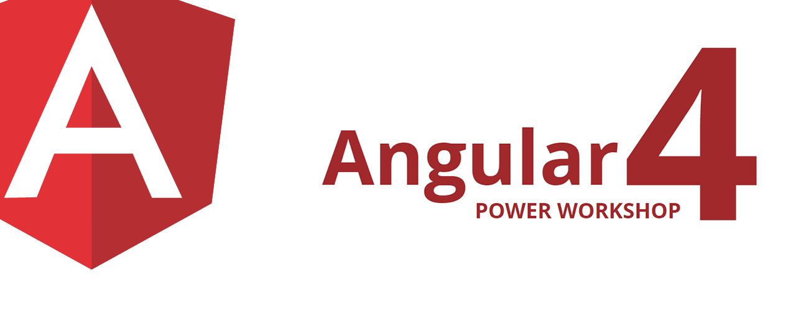
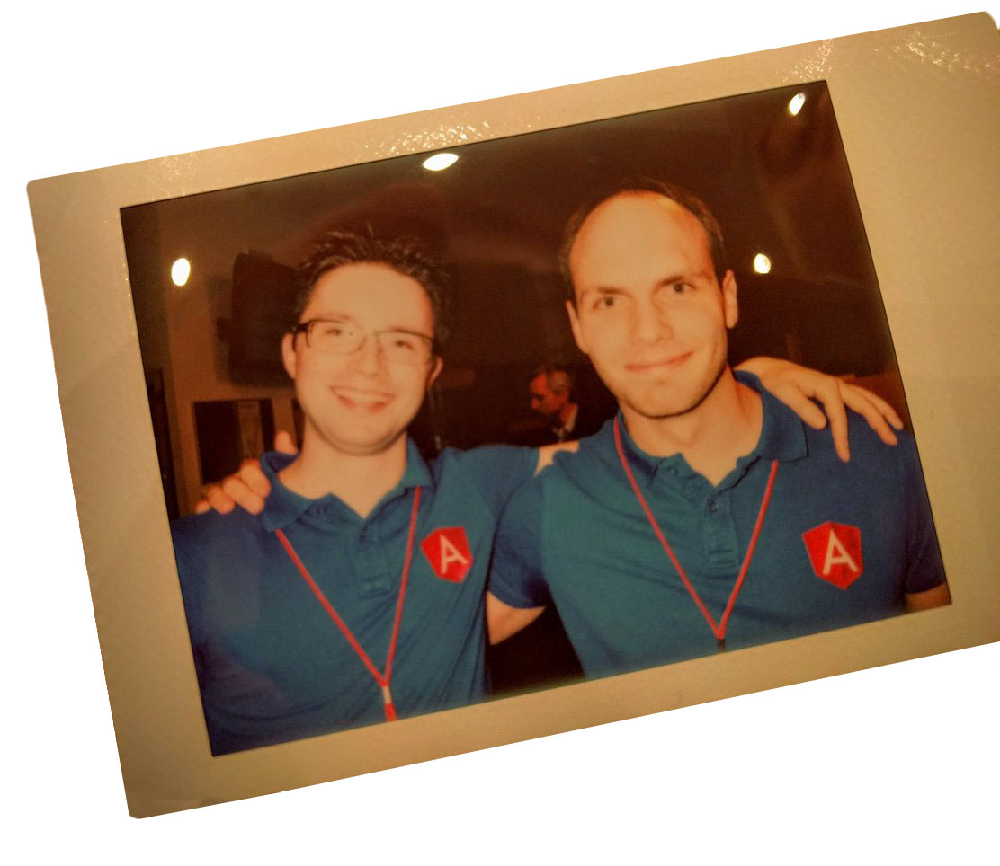

# Angular-Workshop @spartakiade


#### **von Ferdinand Malcher & Johannes Hoppe**

<hr>

Schön, dass Du dabei bist!  
Merke dir schon einmal dieses Repository: https://github.com/angular-buch/angular-workshop-spartakiade  
Damit wir am Samstag gleich durchstarten können, solltest Du ein paar Vorbereitungen treffen.


## Benötigte Software

1. Node.js **6.9** oder höher: [https://nodejs.org](https://nodejs.org)
2. Visual Studio Code **1.8** oder höher: [https://code.visualstudio.com](https://code.visualstudio.com)
3. Google Chrome: [https://www.google.com/chrome/](https://www.google.com/chrome/)
4. Git (und ggf. ein Client wie GitExtensions: [https://gitextensions.github.io](https://gitextensions.github.io))


## Pakete installieren

Alle Windows-User sollten vor Beginn des Kurses die `windows-build-tools` installieren.  
Nach der Installation müsst ihr eine neue Konsole starten!

```
npm install -g windows-build-tools
```

Danach bitte folgenden Befehl ausführen:

```
npm install -g @angular/cli@1.0.0-rc.2
```

...bitte anschließend die Versionen überprüfen:

```
node -v
> Erwartet: v6.9.x oder höher

npm -v
> Erwartet: 3.x oder höher

ng -v
> Erwartet: 1.0.0-rc.2

```

## Startprojekt erzeugen

Bitte lege das Übungsprojekt vor Beginn des Workshops an.  
Wechsel dazu in dein Arbeitsverzeichnis und führe aus:  

```
ng new book-rating --routing
cd book-rating
ng serve
```

Achtung! Die Installation kann sehr lange dauern. Warte beim Schritt `Installing packages for tooling via npm.` mit viel Geduld ab! :-)


> Auf http://localhost:4200 sollte nun eine Website mit dem Text "app works!" erscheinen!
Wenn bei allen Teilnehmern "app works!" erscheint, können wir ohne Zeitverlust loslegen.

### Wir freuen uns auf Samstag! 

Bei Fragen wende Dich einfach direkt an uns!

<hr>




### &copy; 2017 angular-buch.com, Stand: 14.03.2017

**Ferdinand Malcher** [https://www.ferdinand-malcher.de](https://www.ferdinand-malcher.de) &   
**Johannes Hoppe** [https://haushoppe-its.de](https://haushoppe-its.de)


